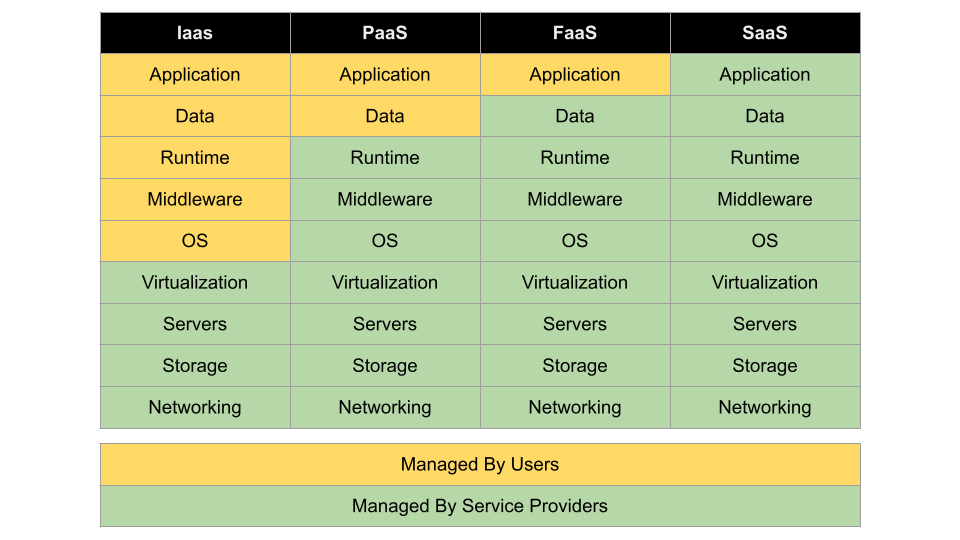

# Cloud Computing

## What is cloud?
Cloud is an on demand delivery of virtual IT resources—hardware, storage, databases, networking, and software—to businesses and individuals via a network (usually the internet). You don't own the infrastructure, you simply rent from the provider.

The concept of cloud computing comes from Virtualization. Virtualization is the process of running the virtual instance of a computer in a layer abstracted from the actual hardware.

## Benifits of cloud computing

### Speed to market
 The biggest advantage of cloud computing is the faster time to market. You can allocatae and deallocate instances in seconds, allowing developers to accelerate development.  
###  Easy to use
Cloud makes managing complex infrastructure easy, as you can manage almost everything virtually.

### Saves money
Whatever cloud service model you choose, you only pay for the resources you actually use. This helps you avoid overbuilding and overprovisioning your data center and gives your IT teams back valuable time to focus on more strategic work.

### Scalability and flexibility
You don't need to overallocate and scale up or down as per your need.

### High uptime
Provides guranteed uptime of applications or services you use in cloud.

## Core services in cloud

### Compute
In cloud computing, the term “compute” describes concepts and objects related to software computation. It is a generic term used to reference processing power, memory, networking, storage, and other resources required for the computational success of any program.
Example of compute services are virtual machine and containers.

### Networking
These are the networking services provided in cloud.
Examples are virtual network, load balancer, dns, etc.

### Storage
Storage offers highly available, massively scalable, durable, and secure storage for a variety of data objects in the cloud.

### Databses
These are the different types of database services available on cloud.

## Cloud offerings

### Platform as a Service PaaS
A service that offers a complete development and deployment environment in cloud.

### Software as a Service SaaS
SaaS is a way of delivering applications over the internet as a service.

### Infrastructure as a Service IaaS
Provides virtualized computing services over the internet.

### Function as a Service FaaS
Allows you to execute code in response to events.

### Serverless
A cloud computing execution model in which the cloud provider allocates machine resources on demad.

 

## Cloud service providers (CSP)

### Major players
- AWS: Feature and service-heavy CSP.
- Azure: Tailored to on-prem as well in addition to public cloud.
- GCP: Major public CSP. Dadicated to development and big data. Multicloud model that can be used with any other CSP.

### Major private/secure CSP
- RedHat
- Dell
- VmWare